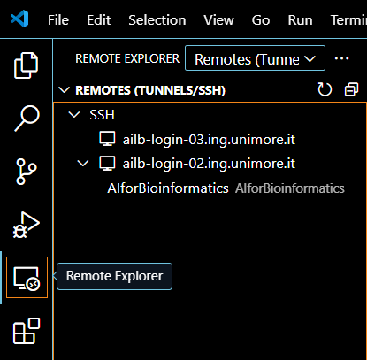
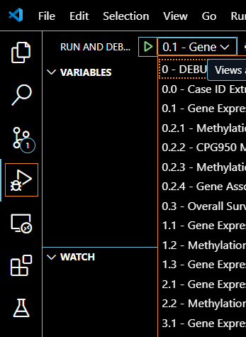

# Guidelines to Connect and Set Up Your AImage Lab Server Space
## Steps:

### 1 - Receiving the credentials
<p align="center">
  
</p>

First, after submitting  the request for server resource allocation, it is necessary to have received the access
credentials, which include:   
 - the **username** provided in the welcome email sent to your institutional UNIMORE mailbox;  
 - the **password**, which matches the one used to access the same mailbox.

 
### 2 - Connecting to the UNIMORE network
To perform the procedure, you must be connected to the UNIMORE network. This can be done:
- by being physically present within the department; 
- by remotely connecting to the network via the university VPN, following  the guide available at this link 
(https://www.sba.unimore.it/site/home/risorse/condizioni-di-accesso-e-vpn.html). 
 
### 3 - Connecting to the server using credentials  
To establish an SSH connection, open the terminal (CMD or BASH) and type one of the following commands (__NOTE__: 
*change the **username** in commands with yours*):
```
ssh <username>@ailb-login-02.ing.unimore.it
ssh <username>@ailb-login-03.ing.unimore.it
```
Then enter your UNIMORE password.
 
### 4 - Setting up environment with Visual Studio Code  
- Open Visual Studio Code and install the extensions **Remote-SSH** and **Remote-SSH: Editing Configuration Files**;
<p align="center">
  
</p>

- Open the Remote Explorer configuration menu on the left and add a new SSH connection configuration using the **+**
button shown selecting the SSH bar;
<p align="center">
  
</p>

- Enter **one of the following commands** based on which part of the server you want to use (__NOTE__: *change the 
**username** in commands with yours*):
```
ssh <username>@ailb-login-02.ing.unimore.it
ssh <username>@ailb-login-03.ing.unimore.it
```
- Select **Linux** as the machine type;
- Enter your password (the same as your UNIMORE account password);
- Ensure you are inside the **/homes/username** directory (__NOTE__: ***username** must be yours*), then open inside a new
terminal and create your Conda environment using the following command(__NOTE__: *change **EnvironmentName** in commands 
with yours and specify a different **python version** dependently on which you need*):
```
conda create --name <EnvironmentName> python=3.10.12
```
- Check the available CUDA modules on the server, then install the required version of PyTorch for your project 
(__NOTE__: *change **EnvironmentName** in commands with yours*):
```
module avail
module unload cuda/12.1
module load cuda/11.8
. /usr/local/anaconda3/etc/profile.d/conda.sh
conda activate <EnvironmentName>
pip install torch==2.2.2 torchvision==0.17.2 torchaudio==2.2.2 --index-url https://download.pytorch.org/whl/cu118
```
__NOTE__: *each time a Conda command needs to be executed after the initial connection, it is necessary to source Conda 
by invoking the conda.sh executable*.

### Optional:
- If you want to clone libraries from an existing environment, first prepare the list from 
that environment using the command:
```
pip freeze > requirements.txt
```
__NOTE__: *check inside this file if certain libraries are present with their relative path. 
If they are, they must be deleted. Furthermore, every 'torch' package must also be deleted*.

- after transferring this file to VSCode in the /homes/**username** directory (__NOTE__: ***username** must be yours*)
on the server (just dragging it) you can add the requirements to the new environment using:
```
pip install -r requirements.txt
```

### 5 - Debugging
Now navigate to the /work/**your_project** directory (__NOTE__: ***your_project** must be yours*) and create a bash.sh 
script containing (__NOTE__: *change **EnvironmentName** and **your_project** in this script with yours*):
```
# Managing CUDA modules
module unload cuda/12.1
module load cuda/11.8

# Sourcing Conda and Activating Environment
. /usr/local/anaconda3/etc/profile.d/conda.sh
conda activate <EnvironmentName>

# Execution command
srun -Q -wailb-login-02 --immediate=10 --mem=8G --partition=all_serial --gres=gpu:1 --nodes=1 --time 1:00:00 --pty --account=<your_project> bash
```
__NOTE__: *all available options for SRUN command are described on the Slurm page at this link 
(https://slurm.schedmd.com/srun.html)*.

 - Once the bash.sh script is made executable, a new shell will open making available a node and a GPU allocated. 
In this shell, you must activate your environment again using (__NOTE__: *change **EnvironmentName** in commands with yours*):
```
. /usr/local/anaconda3/etc/profile.d/conda.sh
conda activate <EnvironmentName>
```
At this point, everything executed within this shell will run on the allocated node and GPU. To exit, you can type exit 
or simply wait for the automatic shutdown, which will occur once the allocated time specified in the initial srun command 
has elapsed.

### Optional
It's possible to automate the procedure by configuring two files within a /work/**your_project**/.vscode folder 
(__NOTE__: ***your_project** must be yours*):
- __settings.json__ (__NOTE__: *change **your_project** in the script with yours*):
```
{ 
    "terminal.integrated.automationProfile.linux": { 
        "path": "/work/<your_project>/bash.sh" 
    }, 
}
```
- __launch.json__ (__NOTE__: *change **your_project** in the script with yours*):
```
{ 
    "configurations": [ 
        { 
            "name": "YOUR GENERAL DEBUGGER”, 
            "type": "debugpy", 
            "request": "launch", 
            "program": "${file}", 
            "console": "integratedTerminal", 
            "justMyCode": false, 
            "env": {"PYTHONPATH":"${<your_project>}"}, 
            "cwd":"${<your_project>}" 
        },
    ]
}
```
__NOTE__: *check the Current Working Directory (**cwd**) of your script to set it correctly in the last JSON*.

Once the two previous files are created, you can run a script from /work/**your_project**/ folder (__NOTE__: 
***your_project** must be yours*) using the run configurations in the top left corner of VSCode.
<p align="center">
  
</p>

### 6 - Production
To actually run the previously debugged code, it is possible to create the script **your_prod**.sbatch within the 
directory /work/**your_project** (__NOTE__: ***your_project** must be yours. Furthermore, inside the following script
**your_name**, **your_project** directory, **your_email**, **EnvironmentName** and both the path of **chdir** and the 
**position of the python script to execute** in the last row must be changed with yours*):
```
#!/bin/bash 
#SBATCH --partition=all_usr_prod 
#SBATCH --gres=gpu:1 
#SBATCH --mem=8G 
#SBATCH --job-name="<your_name>" 
#SBATCH --array=1 
#SBATCH --time=0:02:00 
#SBATCH --output=/work/<your_project>/slurm/slurm_out/%x_%j.out 
#SBATCH --error=/work/<your_project>/slurm/slurm_err/%x_%j.out 
#SBATCH --cpus-per-task=8 
#SBATCH --account=<your_project>
#SBATCH --constraint="gpu_1080_8G|gpu_2080Ti_11G|gpu_A40_48G|gpu_RTX5000_16G|gpu_RTX6000_24G|gpu_RTXA5000_24G" 
#SBATCH --mail-type=ALL 
#SBATCH --mail-user=<your_email>
#SBATCH --chdir=/work/<your_project>/src/<your_code>

module unload cuda/12.1 
module load cuda/11.8 
. /usr/local/anaconda3/etc/profile.d/conda.sh 
conda activate <EnvironmentName>

# Set PYTHONPATH to include the project's main directory (needed if env and cwd paths don’t coincide)
export PYTHONPATH=/work/<your_project>:$PYTHONPATH 

python /work/<your_project>/src/<your_code>.py
```

__NOTE__: *all available **#SBATCH** options are described on the Slurm page at this link
(https://slurm.schedmd.com/sbatch.html)*.

So for running **your_code**.py script (__NOTE__: *chande **your_code.py** with yours) specified in the sbatch file you 
had to type the command:
```
sbatch <your_prod>.sbatch
```

Moreover, with the following last command it is possible to see the status of the requested execution:
```
squeue --me
```
For additional information on setting constraints and configurations, you can visit this AImage Lab Server guide 
(https://ailb-web.ing.unimore.it/coldfront/documentation/flOS4).