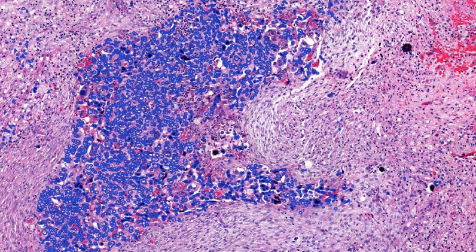

# AIforBioinformatics
### Luca's Master Thesis

  

## Index
- [AIforBioinformatics](.)
    - [README](README.md)
    - [Configuration](./config)
        - [Files](./config/files)
            - [MCAT](./config/files/mcat.yaml)
        - [Methods](./config/methods)
            - [Loader - YAML](./config/methods/configuration_loader.py)
        - [Paths](./config/paths)
            - [Datasets (YAML)](config/paths/dataset_paths.yaml)
            - [Datastores (YAML)](config/paths/datastore_paths.yaml)
            - [Directories (YAML)](config/paths/directories_paths.yaml)
            - [JSONs (YAML)](config/paths/json_paths.yaml)
            - [Tables (YAML)](config/paths/table_paths.yaml)
    - [Configuration PyCharm](./.idea)
    - [Configuration VSCode](./.vscode)
        - [Launch (JSON)](./.vscode/launch.json)
        - [Settings (JSON)](./.vscode/settings.json)
    - [Data](./data)
        - [Datasets](./data/datasets)
            - [BRCA (CSV)](./data/datasets/brca.csv)
            - [Gene Expression & Overall Survival (CSV)](./data/datasets/gene_expression_and_overall_survival_dataset.csv)
            - [Gene Expression & Methylation 27k & Overall Survival (CSV)](./data/datasets/gene_expression_and_methylation27_and_overall_survival_dataset.csv)
            - [Gene Expression & Methylation 450k & Overall Survival (CSV)](./data/datasets/gene_expression_and_methylation450_and_overall_survival_dataset.csv)
            - [Gene Expression & Methylation 27k Statistics & Overall Survival (CSV)](./data/datasets/gene_expression_and_methylation27_statistics_and_overall_survival_dataset.csv)
            - [Gene Expression & Methylation 450k Statistics & Overall Survival (CSV)](./data/datasets/gene_expression_and_methylation450_statistics_and_overall_survival_dataset.csv)
            - [Methylation 27k & Overall Survival (CSV)](./data/datasets/methylation27_and_overall_survival_dataset.csv)
            - [Methylation 450k & Overall Survival (CSV)](./data/datasets/methylation450_and_overall_survival_dataset.csv)
        - [Datastores](./data/datastores)
            - [Gene Expression](./data/datastores/gene_expression)
                - [Gene Expression Data by GeneId (JSON)](./data/datastores/gene_expression/gene_expression_data.json)
                - [Gene Expression Data by GeneName (JSON)](./data/datastores/gene_expression/gene_expression_data_gene_name.json)
            - [Methylation](./data/datastores/methylation)
                - [Methylation Data (JSON)](./data/datastores/methylation/methylation_data.json)
                - [Selected Methylation Data (JSON)](./data/datastores/methylation/gene_associated_methylation_data.json)
                - [Selected Methylation Data - Statistics (JSON)](./data/datastores/methylation/gene_associated_methylation_statistics_data.json)
                - [Selected Methylation Dictionary (JSON)](./data/datastores/methylation/selected_methylation_islands_data.json)
                - [Selected Methylation Dictionary - Full (JSON)](./data/datastores/methylation/selected_methylation_islands_data_full.json)
            - [Methylation Islands for Coding Genes](./data/datastores/cpg950_coding_genes)
                - [CPG950 Data by GeneId (JSON)](./data/datastores/cpg950_coding_genes/cpg950_coding_genes_original_data.json)
                - [CPG950 Data by IslandId (JSON)](./data/datastores/cpg950_coding_genes/cpg950_coding_genes_data.json)
            - [Overall Survival](./data/datastores/overall_survival)
                - [Overall Survival Data (JSON)](./data/datastores/overall_survival/overall_survival_data.json)
        - [Files](./data/files)
            - [Gene Expression (TSV files)](./data/files/gene_expression)
            - [Methylation (TXT files)](./data/files/methylation)
            - [Overall Survival (XML files)](./data/files/overall_survival)
        - [Methods](./data/methods)
            - [Loader - CVS](./data/methods/csv_dataset_loader.py)
            - [Loader - Directory](./data/methods/directory_loader.py)
            - [Loader - TSV](./data/methods/tsv_loader.py)
            - [Loader - XML](./data/methods/xml_loader.py)
            - [Storer - CVS](./data/methods/csv_dataset_storer.py)
        - [Tables](./data/tables)
            - [Ale's Gene Expression Lungs (CVS)](./data/tables/ale_gene_expression_lungs.csv)
            - [Ale's Gene Expression TSS (CVS)](./data/tables/gene_expression_tss.csv)
            - [Ale's Methylation Lungs (CVS)](./data/tables/ale_methylation_lungs.csv)
            - [Ale's Methylation Vectors for each Gene (CVS)](./data/tables/methylation_vectors_for_each_gene.csv)  
            - [Ale's Methylation Vectors for each Gene - Full (CVS)](./data/tables/methylation_vectors_for_each_gene_full.csv)
            - [MCAT Signatures (CVS)](./data/tables/mcat_signatures.csv)
    - [Documents](./docs)
        - [Guidelines to Connect AImage Lab Server Space](./docs/Guidelines%20to%20Connect%20AImage%20Lab%20Server%20Space)
        - [Logo](./docs/logo.jpg)
    - [Error](./error)
        - [Configuration File Error](./error/configuration_file_error.py)
        - [General Error](./error/general_error.py)
    - [JSON Directory](./json_dir)
        - [Indexes](./json_dir/indexes)
            - [Gene Expression TSS Names (JSON)](./json_dir/indexes/gene_expression_tss_names.json)
        - [Methods](./json_dir/methods)
            - [Loader - JSON](./json_dir/methods/json_loader.py)
            - [Storer - JSON](./json_dir/methods/json_storer.py)
        - [Paths](./json_dir/paths)
            - [Gene Expression Input Files Map (JSON)](json_dir/paths/gene_expression.json)
            - [Methylation Input Files Map (JSON)](json_dir/paths/methylation.json)
            - [Methylation Input Files Map - Original (JSON)](json_dir/paths/methylation-original.json)
            - [Overall Survival Input Files Map (JSON)](json_dir/paths/overall_survival.json)

    - [Logs](./logs)
        - [Files](./logs/files)
        - [Methods](./logs/methods)
            - [Storer - STDOUT](./logs/methods/log_storer.py)
        - [Slurm](./logs/slurm)
            - [Slurm Output](./logs/slurm/slurm_out)
            - [Slurm Error](./logs/slurm/slurm_err)
        - [Test](./logs/tests)
    - [Slurm Debug Setting](bash.sh)
    - [Source Files](./src)
        - [Data Extractors](./src/data_extractors)
            - [0.0 - CASE ID Extractor](./src/data_extractors/0.0_case_id_extractor.py)
            - [0.1 - GENE EXPRESSION Extractor ---> 'gene_expression_data.json'](./src/data_extractors/0.1_gene_expression_extractor.py)
            - [0.2.1 - METHYLATION Extractor ---> 'methylation_data.json'](./src/data_extractors/0.2.1_methylation_extractor.py)
            - [0.2.2 - METHYLATION ISLANDS Counter per GENE ---> 'cpg950_coding_genes_original_data.json'](./src/data_extractors/0.2.2_cgp950_methylation_islands_counter_per_gene.py)
            - [0.2.3.1 - METHYLATION VECTORS for each GENE Ale's Extractor ---> 'selected_methylation_islands_data.json'](./src/data_extractors/0.2.3.1_methylation_vectors_for_each_gene.py)
            - [0.2.3.2 - METHYLATION VECTORS for each GENE Full Extractor  ---> 'selected_methylation_islands_data_full.json'](./src/data_extractors/0.2.3.2_methylation_vectors_for_each_gene.py)
            - [0.2.4.1 - GENE ASSOCIATED METHYLATION Extractor ---> 'gene_associated_methylation_data.json'](./src/data_extractors/0.2.4.1_gene_associated_methylation_extractor.py)
            - [0.2.4.2 - GENE ASSOCIATED METHYLATION STATISTICS Extractor ---> 'gene_associated_methylation_statistics_data.json'](./src/data_extractors/0.2.4.2_gene_associated_methylation_statistics_extractor.py)
            - [0.3 - OVERALL SURVIVAL Extractor ---> 'overall_survival_data.json'](./src/data_extractors/0.3_overall_survival_extractor.py)
        - [Dataset Creators](./src/dataset_creators)
            - [1.1 - GENE EXPRESSION & OS - Dataset ---> 'gene_expression_and_overall_survival_dataset.csv'](./src/dataset_creators/1.1_gene_expression_&_overall_survival.py)
            - [1.2 - METHYLATION & OS - Dataset ---> 'methylation_and_overall_survival_dataset.csv'](./src/dataset_creators/1.2_methylation_&_overall_survival.py)
            - [1.3.1 - GENE EXPRESSION & METHYLATION & OS - Dataset ---> 'gene_expression_and_methylation_and_overall_survival_dataset.csv'](./src/dataset_creators/1.3.1_gene_expression_&_methylation_&_overall_survival.py)
            - [1.3.2 - GENE EXPRESSION & METHYLATION STATISTICS & OS - Dataset ---> 'gene_expression_and_methylation_and_overall_survival_dataset.csv'](./src/dataset_creators/1.3.2_gene_expression_&_methylation_&_overall_survival.py)
        - [Binary Classification](./src/binary_classification)
            - [SkLearn Functions](./src/binary_classification/functions_sklearn)
            - [2.1 - GENE EXPRESSION & OS (SKLEARN)](./src/binary_classification/2.1_ge_&_os_sklearn.py)
            - [2.1 - GENE EXPRESSION & OS (SKLEARN) - SBATCH](./src/binary_classification/2.1_ge_&_os_sklearn.sbatch)
            - [2.2 - METHYLATION & OS (SKLEARN)](./src/binary_classification/2.2_methylation_&_os_sklearn.py)
            - [2.2 - METHYLATION & OS (SKLEARN) - SBATCH](./src/binary_classification/2.2_methylation_&_os_sklearn.sbatch)
            - [PyTorch Functions](./src/binary_classification/functions_torch)
            - [PyTorch Model Weights](./src/binary_classification/model_weights)
            - [3.1 - GENE EXPRESSION & OS - (GPU)](./src/binary_classification/3.1_ge_&_os_gpu.py)
            - [3.1 - GENE EXPRESSION & OS - (GPU) - SBATCH](./src/binary_classification/3.1_ge_&_os_gpu.sbatch)
            - [3.2 - METHYLATION & OS - (GPU)](./src/binary_classification/3.2_methylation_&_os_gpu.py)
            - [3.2 - METHYLATION & OS - (GPU) - SBATCH](./src/binary_classification/3.2_methylation_&_os_gpu.sbatch)
            - [3.3 - GENE EXPRESSION & METHYLATION & OS - (GPU)](./src/binary_classification/3.3_ge_&_methylation_&_os_gpu.py)
            - [3.3 - GENE EXPRESSION & METHYLATION & OS - (GPU) - SBATCH](./src/binary_classification/3.3_ge_&_methylation_&_os_gpu.sbatch)
            - [4.1 - GENE EXPRESSION & OS - (GPU) V1](./src/binary_classification/4.1_ge_&_os_gpu_v1.py)
            - [4.1 - GENE EXPRESSION & OS - (GPU) V1 - SBATCH](./src/binary_classification/4.1_ge_&_os_gpu_v1.sbatch)
            - [4.2 - METHYLATION & OS - (GPU) V1](./src/binary_classification/4.2_methylation_&_os_gpu_v1.py)
            - [4.2 - METHYLATION & OS - (GPU) V1 - SBATCH](./src/binary_classification/4.2_methylation_&_os_gpu_v1.sbatch)
            - [4.3 - GENE EXPRESSION & METHYLATION & OS - (GPU) V1](./src/binary_classification/4.3_ge_&_methylation_&_os_gpu_v1.py)
            - [4.3 - GENE EXPRESSION & METHYLATION & OS - (GPU) V1 - SBATCH](./src/binary_classification/4.3_ge_&_methylation_&_os_gpu_v1.sbatch)
            - [5 - GENE EXPRESSION & METHYLATION STATISTICS & OS - (GPU)](./src/binary_classification/5_ge_&_methylation_statistics_&_os_gpu.py)
            - [5 - GENE EXPRESSION & METHYLATION STATISTICS & OS - (GPU) - SBATCH](./src/binary_classification/5_ge_&_methylation_statistics_&_os_gpu.sbatch)
          - [MCAT](./src/mcat) 
            - [Checkpoints](./src/mcat/checkpoints)
            - [Modules](./src/mcat/modules)
            - [Outputs](./src/mcat/outputs)
            - [Wandb](./src/mcat/wandb)
            - [6 - MCAT](./src/mcat/6_mcat.py)
            - [6 - MCAT - SBATCH](./src/mcat/6_mcat.sbatch)
    - [GitIgnore](.gitignore)
    - [LICENCE](LICENSE)
    - [Requirements](requirements.txt)